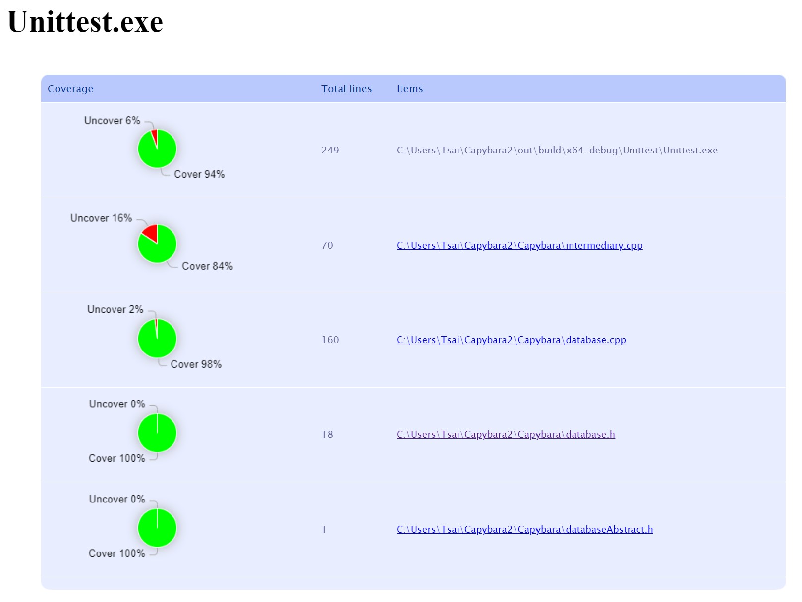

# Capybara

Table of Contents:

* Setting up the Environment for Service
* Setting up the Environment for Client
* API Documentation
* Multiple Client Instances
* Testing
* CI Pipeline
* Acknowledgement
* Appendix

## Setting up the Environment for Service

Follow [this guide](https://everythingtech.dev/2023/06/step-by-step-guide-on-how-to-get-started-with-drogon-on-windows-with-visual-studio/) to set up the environment. A few things that differ from the tutorial:
* Step 2.7: Along with the tutorial. Run these commands:
  ```
  vcpkg install nlohmann-json
  vcpkg install sqlite3
  ```
  _If you encounter issues with Step 2.7, uninstall `cmake` and try again._
* Step 3.2: Don't follow the tutorial. Instead:
  * Create a **CMake** C++ project with Visual Studio 2022. Call the project Capybara.
  * Copy the `.gitignore` file on GitHub to the root directory, exactly placed as shown on the repo. We will hard pull the code on the repo, but we want to keep the config files generated by VS, so we need this to let git untrack them.
  * In terminal, go to project root directory:
  ```
  git init
  git status //make sure .vs/ and out/ does not appear
  git remote add origin https://github.com/mm6234/Capybara.git
  git remote -v
  // origin  https://github.com/mm6234/Capybara.git (fetch)
  // origin  https://github.com/mm6234/Capybara.git (push)
  git fetch --all
  git reset --hard origin/main
  ```
* Step 3.4: Change the file named `CMakePresets.json` at the root directory. Change `toolchainFile`'s directory to `vcpkg.cmake` (see appendix). Use two slashes `\\` when defining each stage of the directory location. 
* Step 3.5 and 3.6: Do not need to modify; the change should already be reflected in the repo. 

After the tutorial, build the code (Build Menu > Build All) and run the .exe file in the Capybara directory. Run the .exe file in the Unittest directory to run unit tests for this project. Use tools such as **postman** or **curl** to test the program.

[Update] As for now, the database automatically creates when you start the program, so no need for the API command below

__IMPORTANT:__ Before you start, create the database table by entering the following api command:

```
http://127.0.0.1:6969/
```
You should see a Capybara string. Running the API again would not make a difference (using CREATE TABLE IF NOT EXISTS).

## Setting up the Environment for Client
* Step 1: Install [Node.js](https://nodejs.org/en/download).
* Step 2: Once installed run ```npm install http-server -g``` in your terminal.
* Step 3: Go to the directory where the frontend files are present in the terminal.
* Step 4: Now run the command ```http-server```.
* Step 5: Access the frontend on your browser using the URL- ```localhost:8080```.
* Note the Capybara API must be running before you access the frontend

## API Documentation

### Retrieve the Doctor's Info Based on the Doctor's ID

```
GET http://127.0.0.1:6969/api/doctor-info/{DoctorId}
```

**Example Return Body (Includes All Possible Fields):**
```
{
  "id": 3,
  "doctorName": "Capybara",
  "rating": 3.5,
  "submissions": 1834,
  "location": {
    "latitude": 3.222,
    "longitude": 78.43
  },
  "practiceKeywords": [
    "Ear",
    "Nose",
    "Throat"
  ],
  "languagesSpoken": [
    "English"
  ],
  "Insurance": [
    "Aetna"
  ],
  "Other": {
    "streetAddress": "NYC"
  }
}
```

If the doctor `id` cannot be coverted to an integer or it does not exist, a _400 bad request_ is returned.

```
{"error": "Illegal 'id' field!"}
```

### Create/Update Doctor Information

Fields that you can update:
```
id, doctorName, rating, ratingSubmissions,
latitude, longitude, practiceKeywords,
languagesSpoken, insurance, streetAddress
```
```
POST http://127.0.0.1:6969/api/update
```

If `id` is not included, we create a new doctor record and return the id.

**Example Request Body to Create a Doctor Record:**
```
{
  "fieldToUpdate": "doctorName",
  "fieldValue": "Capybara Elite", 
  "clientUserName": "client"
} 
```

**Example Return Body to Create a Doctor Record:**
```
{
    "id": 1
}
```
If `id` is included, then the existing doctor record is updated.

**Example Request Body to Update Doctor Record:**
```
{
  "id": 3,
  "fieldToUpdate": "doctorName",
  "fieldValue": "Capybara Elite", 
  "clientUserName": "client"
} 
```

If the Json format is invalid, a _400 bad request_ is returned.
Request Json:
```
{
  "id": 3,
  "fieldToUpdate": "doctorName"
}
```
Return body:
```
{
    "error": "Invalid JSON format in the request body"
}
```
__IMPORTANT:__ `id` is an integer and should never have double quotes.
`fieldValue` should always have double quotes, even if the field is a number.

### Doctor Recommendations

**Example: Sort by Rating**

```
GET http://127.0.0.1:6969/api/query/Yes/No/

# GET http://127.0.0.1:6969/api/query/Yes/Yes/ will also output a sorted list by ranking. The first 'Yes' is the only one considered by design.
```

This will output the highest doctor rating.

**Example: Sort by Number of Supplied User Rankings**

```
GET http://127.0.0.1:6969/api/query/No/Yes/
```

This will output the highest doctor submission count.

**Example: Sort by Location**

```
GET http://127.0.0.1:6969/api/query/No/No/100.1_100.3
```

This will output doctors stored in the database in the order of closest to furthest distance from the user's supplied location. (Using Manhattan Distance)

### Register

To register the client service, complete the following:

```
POST http://127.0.0.1:6969/api/register
```
```
{
    "clientUserName": "client"
}
```
If succeeded, a 200OK would return. If not, it is usually due to formatting error:
```
{
    "error": "Invalid JSON format in the request body"
}
```

## Multiple Client Instances

When a client wants to write information to the database, 
it first needs to register with the service. Then, 
it needs to provide `clientUserName` for all POST requests. 

Here are some conditions where we allow the overwrite:
1. If the client is registered and we want to create a new doctor info. 
2. If we want to update an existing doctor info, and the provided client is
the same as the client that created the data. 

Otherwise, the request will be blocked. By doing so, we made sure that the service
can tell different clients apart when a request is made, and have data access limitations based on the client
provided. We can also know the providing client for every doctor data. 
Please note that all GET apis are not affected by this. As we imagined the service
to have multiple clients, it doesn't make sense to limit search functionality. In other words, 
data provided by different clients are shared by all. But for altering data, that's where 
the service needs to tell them apart and make restrictions. The system is still able to 
differentiate concurrent GET requests and deliver the different results, it's just that the 
service does not deliberately track them. 


##  Unit/Internal Integration/External Integration Testing
We use [GoogleTest](https://github.com/google/googletest); in Visual Studio, 
simply build the whole project, go to the build folder `.\out\build\x64-debug\Unittest` and run `.\Unittest.exe` from the terminal. 

All testing are located in one file `Unittest.cc`. There are comments to indicate unit/internal integration/external integration testing. 

If the test involves writing to the database, we group all of them in one test since the latter tests would be 
based on the former tests that write data. The tests are intended to run in one order. If not (ex: use mocks), 
then the tests are grouped individually. 

__IMPORTANT__ : The database instance is separate from the instance used in production. 

## CI Pipeline
The Capybara service uses Github Actions for continuous integration testing.
The `build-test-cmake-cpp.yml` script is executed each time a commit is made, 
and can even be run manually by pressing the 'Run workflow' dropdown, selecting the 'main' branch, 
and pressing the green 'Run workflow' button from 
[this link](https://github.com/mm6234/Capybara/actions/workflows/build-test-cmake-cpp.yml).
Check out [one of our latest run](https://github.com/mm6234/Capybara/actions/runs/7135355458/job/19431947169)
to reference the points explained below. 

### Build the system
Instead of using Visual Studio to build, we use `cmake` with `MSVC` complier. 

### Run Unit/Internal Integration/External Integration Tests
Runs the code at `Unittest.cc`. At the very bottom of the terminal output, you should see something like this: 
```
[----------] Global test environment tear-down
[==========] 18 tests from 8 test suites ran. (275 ms total)
[  PASSED  ] 18 tests.
```

### Branch Coverage
We use [OpenCppCoverage](https://github.com/OpenCppCoverage/OpenCppCoverage). 
Before we talk about the CI pipeline, first let's run it locally on the terminal:
```
choco install opencppcoverage # you need to install chocolatey first
Import-Module "$env:ChocolateyInstall\helpers\chocolateyProfile.psm1"
refreshenv
mkdir CoverageReport
OpenCppCoverage --sources <absolute path to repo root folder>\Capybara --excluded_sources <absolute path to repo root folder>\Unittest --export_type html:CoverageReport -- <absolute path to Unittest.exe>
```
Open `./CoverageReport/Modules/Unittest.html`, the result would look something like this:

This is our latest result; calculating the total coverage with their respective total lines per file, it is apparent that we reached over 85%. 

In the CI pipeline, we simply print out the text from the HTML file. Directly copying them would not produce the
same results due to a lack of 3rd party libraries. Scroll down to the very bottom, look for the `<canvas>` tag. 
Each canvas represents an entry. The format is as follows:
```
            <canvas id="pi_XXXXX" width="280" height="100">{{{Covered percentage}}}</canvas>
                    </td>            
                    <td>{{{Total lines for the file}}}</td>
                    <td>            
                       <a href="XXXxx.html">{{{File name}}}</a> 
                      
                      
                    </td>
                </tr>   
```
For example, for `database.cpp`, you would get:
```
            <canvas id="pi_56da1a39-82ea-4950-8ad1-5b79a5d27cc4" width="280" height="100">Cover 98%</canvas>
                    </td>            
                    <td>160</td>
                    <td>            
                       <a href="Unittest/database.cpp.html">D:\a\Capybara\Capybara\Capybara\database.cpp</a> 
                      
                      
                    </td>
                </tr>   
```
Through this, we can get the results for branch coverage. 

### Bug finder
We use [cppcheck](https://github.com/danmar/cppcheck). Scroll to the very bottom to see the result of the run. 

## Acknowledgement
* `.gitignore` file template from github's [gitignore repo](https://github.com/github/gitignore/blob/main/VisualStudio.gitignore). Used for best practices. 
* Packages used: Drogon, jsoncpp, nlohmann-json, SQLite3, gtest
* Tools used: opencppcoverage, cppcheck

## Appendix
`CMakePresets.json`: Change `toolchainFile` to the approptiate directory. For example: `"C:\\Users\\iamyo\\projects\\vcpkg\\scripts\\buildsystems\\vcpkg.cmake"`
```
{
    "version": 3,
    "configurePresets": [
        {
            "name": "windows-base",
            "hidden": true,
            "generator": "Ninja",
            "binaryDir": "${sourceDir}/out/build/${presetName}",
            "installDir": "${sourceDir}/out/install/${presetName}",
            "cacheVariables": {
                "CMAKE_C_COMPILER": "cl.exe",
                "CMAKE_CXX_COMPILER": "cl.exe"
            },
            "condition": {
                "type": "equals",
                "lhs": "${hostSystemName}",
                "rhs": "Windows"
            }
        },
      {
        "name": "x64-debug",
        "displayName": "x64 Debug",
        "inherits": "windows-base",
        "architecture": {
          "value": "x64",
          "strategy": "external"
        },
        "cacheVariables": {
          "CMAKE_BUILD_TYPE": "Debug"
        },
        "toolchainFile": "<Insert your directory to vcpkg.cmake>"
      },
        {
            "name": "x64-release",
            "displayName": "x64 Release",
            "inherits": "x64-debug",
            "cacheVariables": {
                "CMAKE_BUILD_TYPE": "Release"
            }
        },
        {
            "name": "x86-debug",
            "displayName": "x86 Debug",
            "inherits": "windows-base",
            "architecture": {
                "value": "x86",
                "strategy": "external"
            },
            "cacheVariables": {
                "CMAKE_BUILD_TYPE": "Debug"
            }
        },
        {
            "name": "x86-release",
            "displayName": "x86 Release",
            "inherits": "x86-debug",
            "cacheVariables": {
                "CMAKE_BUILD_TYPE": "Release"
            }
        },
        {
            "name": "linux-debug",
            "displayName": "Linux Debug",
            "generator": "Ninja",
            "binaryDir": "${sourceDir}/out/build/${presetName}",
            "installDir": "${sourceDir}/out/install/${presetName}",
            "cacheVariables": {
                "CMAKE_BUILD_TYPE": "Debug"
            },
            "condition": {
                "type": "equals",
                "lhs": "${hostSystemName}",
                "rhs": "Linux"
            },
            "vendor": {
                "microsoft.com/VisualStudioRemoteSettings/CMake/1.0": {
                    "sourceDir": "$env{HOME}/.vs/$ms{projectDirName}"
                }
            }
        },
        {
            "name": "macos-debug",
            "displayName": "macOS Debug",
            "generator": "Ninja",
            "binaryDir": "${sourceDir}/out/build/${presetName}",
            "installDir": "${sourceDir}/out/install/${presetName}",
            "cacheVariables": {
                "CMAKE_BUILD_TYPE": "Debug"
            },
            "condition": {
                "type": "equals",
                "lhs": "${hostSystemName}",
                "rhs": "Darwin"
            },
            "vendor": {
                "microsoft.com/VisualStudioRemoteSettings/CMake/1.0": {
                    "sourceDir": "$env{HOME}/.vs/$ms{projectDirName}"
                }
            }
        }
    ]
}

```
